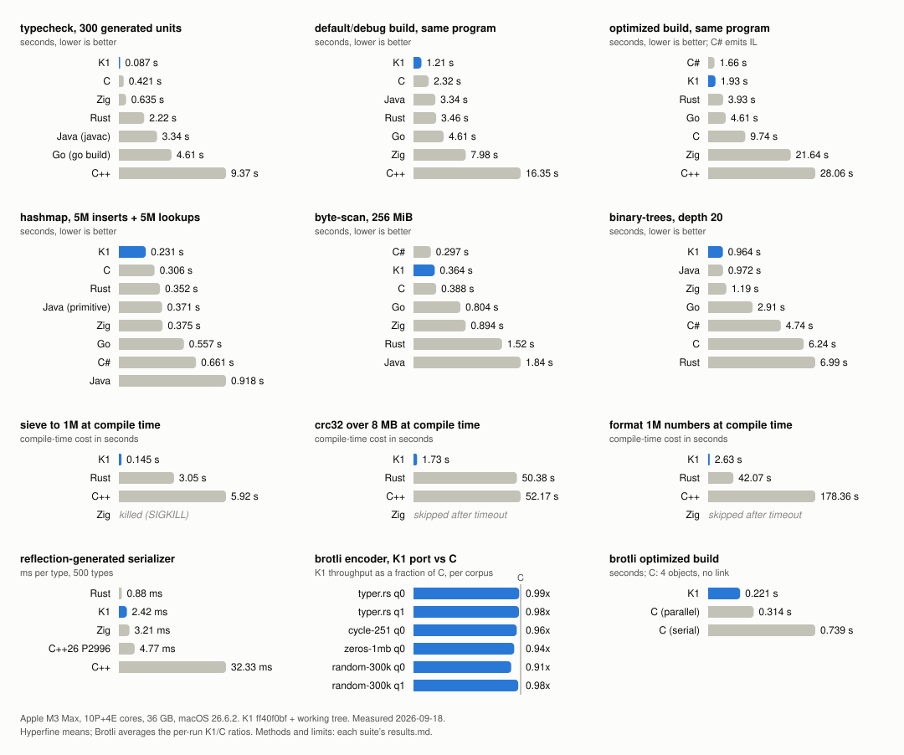

# K1 showcase

K1 is a compiled systems language: LLVM backend, C ABI, arenas by default,
typeclasses ("abilities"), and a compile-time VM that runs the same language,
the same standard library and the same functions as the binary. Every program
below is real: it lives under `examples/`, it is compiled and run by
`check.sh`, and every code block in `sections/` is checked verbatim against
its source file. Compiler output quoted in the sections was captured from
those runs, on an Apple M3 Max, macOS 26.6, K1 0.1.0 built from the
2026-09-17 tree.

```bash
./content/showcase/check.sh
```

runs every example (the `_wrong` and `_fail` files must fail to compile with
the message declared on their last line) and verifies the sections.

## The reel

1. [`#static`: the compiler runs your program](sections/01-static.md).
   A string literal is a type, so `let greeting: "hello world" = #static {
   ... }` is checked against what the compile-time run produced, and one
   wrong byte is a type error. A global's type is its value. A CRC32 table
   whose self-test is the declared type of the result. A Brainfuck interpreter
   run by the compiler. A program that unit-tests its own type errors with
   `test-compile`.
2. [A palette authored in OKLCH, shipped as bytes](sections/02-palette.md).
   The color module from a real UI workbench, unchanged: trig and `pow`
   through libm, evaluated in the compiler, landing in the binary as `u8`
   triples. A WCAG contrast lint the build enforces, and a CSS block generated
   into a string constant.
3. [The compile-time VM can call C](sections/03-comptime-ffi.md). Global
   initializers call libc for a build stamp. A module compiles two lines of C
   around stb_truetype in its build step, the VM `dlopen`s it while compiling,
   and a font atlas rasterized at compile time is a 32 KiB constant in the
   executable that never links stb.
4. [Reflection: a type is a value you can look at](sections/04-reflection.md).
   `types/schema[t]` is a sum you pattern match. A JSON serializer generated
   per type, a `show` that derives itself for any type, P2996's
   `enum_to_string` both ways, a pahole in a screenful, and `assert-layout`
   as a compile-time guard.
5. [Macros and metaprogramming](sections/05-macros.md). Arguments arrive as
   `code` with spans, so an error inside an expansion carets the caller's
   argument, and a `crash` inside an emitter is reported at the `crash` with
   the VM's stack. A state machine generated from a table and tested by the
   compiler against that table. `std/bitfield`, struct-of-arrays, and the
   typed HTTP router with compile-time reachability checks.
6. [A regex engine that runs at compile time](sections/06-regex.md). Parser,
   Thompson NFA, subset construction and DFA minimization in 270 lines of
   plain K1; the macro emits a matcher whose states are match arms.
7. [Generators: a keyword recognizer and a Brainfuck compiler](sections/07-generators.md).
   gperf as a macro, with an honest benchmark against the naive match. A
   Brainfuck-to-K1 compiler whose output is run by the VM and checked
   against a literal type.
8. [Types are values](sections/08-types.md). A struct synthesized from a
   schema string, an enum from a table with explicit tags, struct transforms,
   static parameters (`matrix[n: static size]`), predicate bounds that are
   ordinary functions over the schema, `never` and zero-sized types, and
   static specialization with type patterns.
9. [The runtime model](sections/09-model.md). Abilities, blanket impls,
   ability objects with inline function tables, closures that capture only
   what you name, context parameters, `.try` as an ability you can implement
   for a C status code, arenas with O(1) reset, and exhaustive matching
   through references.
10. [Systems programming](sections/10-systems.md). A SIMD scanner generated
    at compile time and run in the VM, typed tasks over threads built from a
    closure's own type, atomics, FFI with no bindings file, build steps that are K1 running inside the compiler, a K1
    library consumed from C, hot reload, and the same programs on wasm and
    bare metal.

## Performance

Each benchmark has an unattended `run.sh` that regenerates its `results.md`
with machine details, toolchain versions, methodology, and measurements.
The graph reads those exports directly; regenerate it with
`python3 content/showcase/benchmarks/chart.py` after running all four suites.
[Run provenance](benchmarks/run-info.json) records the compiler revision,
working-tree status, binary hash, and measurement dates.



- [Runtime classics](benchmarks/runtime/results.md): binary-trees, hashmap,
  and byte-scan, with outputs cross-checked before timing. Whole-process
  timings include JVM/CLR startup; the report also measures their steady
  state and every language's peak RSS. Allocation and library choices
  matter: K1 and Zig use arenas for binary-trees, Java's standard hashmap
  boxes its keys and values, and C# uses its vectorized byte-search library.
  The report includes a Java primitive-table comparison. Python is stock
  CPython with the standard library only.
- [Compile times](benchmarks/compile-times/results.md): equivalent generated
  application-shaped programs at 10, 100, and 300 units, plus hello world
  and Brotli. K1's main rows rebuild core and std from source with
  `--cache false`; separate rows measure module caching. The report includes
  default and optimized builds, per-phase traces, and each toolchain's cache
  policy. Java emits bytecode and C# emits IL, so those builds defer native
  compilation until runtime.
- [Compile-time execution](benchmarks/comptime/results.md): sieve, CRC32,
  string formatting, and generated JSON serializers. Execution cost is the
  build time minus a runtime-work control; reflection cost subtracts the
  zero-type baseline. Successful outputs are checked against a reference.
  Each feasibility compile has a 300-second limit, and larger cases after a
  timeout are skipped. Failures remain visible in the graph and report.
- [Brotli](benchmarks/brotli/results.md): the K1 quality 0/1 encoders and
  vendored C encoder run in one process, interleaved per repetition. The
  harness checks byte parity and streaming round trips. The graph averages
  the per-run K1/C throughput ratios. The current bit writer takes an
  `inout` pointer; the [earlier investigation](benchmarks/brotli.md) records
  the previous by-value workaround and its assembly findings.

K1 performs IR optimization and program inlining before splitting LLVM
units. Optimized builds retain LLVM's per-unit O3 passes and ThinLTO, with
cross-unit importing disabled. Default builds use the lighter LLVM pipeline.
Compiler time, emitted-program runtime, and compile-time VM execution are
separate measurements; improvements in one do not imply improvements in the
others.
