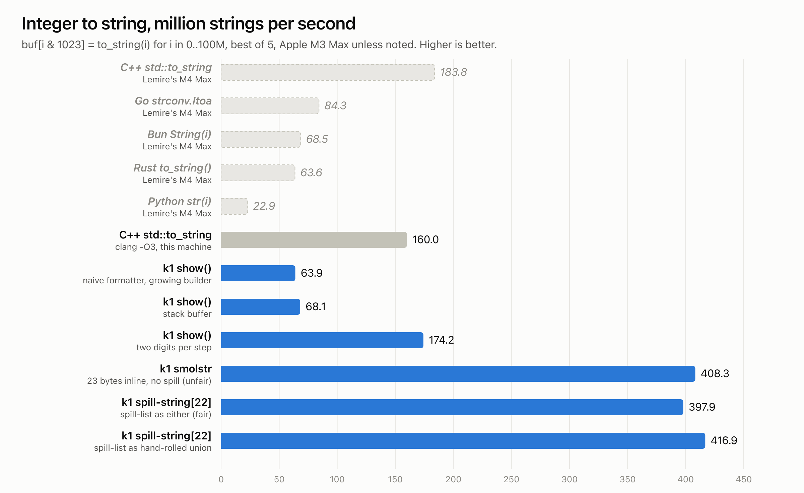

# 417 million strings per second in k1

[@lemire asked](https://x.com/lemire/status/2103454566645710975) how many strings per second your language can make: `buf[i & 1023] = to_string(i)` for 100 million integers.

I decided to see where k1 was sitting!



We beat C++, the fastest from Lemire's lineup, by just a hair even while allocating every single string to the heap!

When we switch to inline storage for fairness with the C++ string, we hit 2.6x

Note that our machine is 13% slower than Lemire's on baseline; both C++ baselines included. Close enough though that I'm going to use numbers from my local here, following typical benchmarking best practices (hyperfine, best-of-n runs, interleaving)

## The journey

**64M/s, naive.** `i.show()` printed through a string builder that started empty and grew-on-push (0->8,8->16), then copied the result into a fresh string. The decimal formatter divided by ten per digit, pushed each digit onto a list, and reversed it. The naive algorithm you write when you really just want to get hello world working! Which was me a few years ago!

**68M/s, stack buffer.** `show()` now prints into a 64-byte stack buffer and copies once. This step revealed that the formatter was the problem.

**174M/s, a real formatter.** Write digits backwards, two per step from a 200-byte pair table, no push, no reverse. (Every k1 program gets this implementation now)

Here's the construction of the static lookup table, thanks to k1's compile-time execution:
```k1
let DECIMAL_PAIRS: array[u16, 100] = {
  let pairs: array[u16, 100] = uninit
  for i in (0: u8).until(100) {
    let two: array[u8, 2] = [u8/to-ascii-digit(i / 10).as-u8(), u8/to-ascii-digit(i % 10).as-u8()]
    pairs.[i.widen[size]] = mem/read-unaligned[u16](two.&.as[ptr])
  }
  pairs
}
```
```llvm
@_root__core__DECIMAL_PAIRS = internal unnamed_addr constant [100 x i16] [i16 12336, i16 12592, i16 12848, ...
```

Each pair is one 16-bit load from the table and one 16-bit store into the digit buffer, and both sides are bounds-checked in the source:

```k1
fn(inline) _write-decimal-pair(digits: *array[u8, 64], at: size, pair: u64) {
  let dst = checked-index(at, 63)
  mem/write-unaligned(digits.as[ptr].add-bytes(dst), DECIMAL_PAIRS.[pair.signed()])
}
```

The table has 100 entries and the index is `n % 100`, so LLVM proves the table check can never fail and deletes it.

**408M/s, smolstr.** But `show()` was paying for something that C++ wasn't: an allocation, albeit a bump arena allocation, plus a copy per string. libc++ keeps short strings inside the object, so I did too: 23 bytes inline plus a length byte, never allocates. But this isn't completely fair, as this `smolstr` can't grow past 23 bytes, so its harder to reach for.

**398M/s, spill-string.** `spill-string[n]` holds up to n bytes inline and spills to the arena past that, so now it's apples to apples with `std::string`. It's built on k1's existing `spill-list`, which was an `either` of an inline list and a heap list: 40 bytes.

**417M/s, a hand-rolled sum.** `spill-list` is now a union whose two variants both start with a `u32`: the inline length, or a SPILLED sentinel. 32 bytes, 28 of them inline, and zeroed memory is a valid empty value. A bit less ergonomic, a bit more 'unsafe', but for corelib datastructure code like this that is the tradeoff you want to make, as its easy to check the correctness. It even edges out the unfair smolstr.

## No compiler support

This is the core of it:

```k1
type spill-list[t, n: static size] = union {
  inline: { len: u32, items: array[t, n] },
  spilled: { marker: u32, list: list[t] },
}

type spill-string[n: static size] = { bytes: spill-list[u8, n] }

impl[n: static size] writer for *spill-string[n] {
  fn(inline) write-byte(self, value: u8) { self.bytes.&.push(value) }
  fn(inline) write-bytes(self, bytes: span[u8]) { self.bytes.&.push-n(bytes) }
}
```

`n: static size` puts a compile-time number in the type. `union` gives you overlapping storage and you choose the discriminant. Implement `writer` and anything that can `print` writes straight into it; implement `equals` and `hash` and it's a map key. There is no blessed string type to work around: k1's own `string` is a library type too! `{ span: span[char] }`.

## Build times

Compiling the benchmark, optimized, wall time including the link (hyperfine, same M3 Max):

- `clang++ -O3`: 321 ms
- `k1 --optimize`: 85 ms

3.8x faster. Most of clang's time goes to parsing `<string>`, `<chrono>` and `<cstdio>`; k1 compiles the program and links it, with `core` and `std` coming from its module cache.

## Memory

Peak resident memory for the whole process, from `/usr/bin/time -l`:

- C++ `std::to_string`: 1.8 MB
- k1 `spill-string[22]`: 1.9 MB
- k1 `show()`: 2.0 MB

C++ never allocates here; every string fits in the object. `spill-string` doesn't either. `show()` allocates every string, so it runs on two small arenas that take turns: each one is reset before its next block of 4096 strings, and the ring of 1024 live strings never reaches back that far. Throughput is the same whether the blocks are 1024 strings or 4 million.

## Why not replace `k1/core/string` with spill-string[22]?

- Lower allocation cost: SSO exists in C++ because every C++ string owns heap memory, and malloc plus free per short string is expensive. A k1 string is usually a view into bump-allocated arena memory, so allocating is much cheaper
- Slices stop being free. String literals, split, slice, trim and drop all return zero-copy views today. A slice of an inline string would point into the value's own bytes, and K1 copies aggregates freely. C++ answers this with a second type, string_view, and then every API has to choose between the two.
- Pointer stability goes away. With inline storage, any span from as-string() goes stale as soon as the value is copied.
- Size doubles. 32 bytes instead of 16, in every struct field, list[string], and map key/value slot. Programs heavy on strings, like the compiler itself, would pay in cache misses everywhere, not just where the strings are short.
- Every read branches. len() and the data pointer need an inline-or-spilled check. Views are branch-free, which matters for the SIMD seek and index-of-span paths that dispatch on byte spans.
- They're different things; k1's `string` is for viewing; `spill-string` or `list[u8]` are for building.

## Agents and k1

I didn't write this benchmark or `spill-string`; just the compiler and the rest of k1. I pasted the tweet into an Opus 5.5 session and said "write a k1 version." Then: make `show` use a stack buffer. Rewrite the formatter. Implement a smolstr. Make it generic with a spill path. Make spill-list a hand-rolled sum.

Agents are great at k1 because the whole standard library is plain k1, and there are very, very few compiler builtins. The model can read and almost fit in context. Heck, the entire compiler almost even fits in context! Very little is magic or builtin (our string is a userland type).

## Repro

```
git clone https://github.com/kolemannix/k1 && cd k1
just install # you'll need llvm; sorry! Unreleased language problems
content/showcase/benchmarks/int-strings/run.sh
```

The k1 program is [`content/showcase/benchmarks/int-strings/k1/int_strings.k1`](https://github.com/kolemannix/k1/blob/master/content/showcase/benchmarks/int-strings/k1/int_strings.k1), and the C++ baseline is Lemire's loop verbatim with a best-of-5 timer. `run.sh` reproduces the final `show()`, spill-string and C++ bars. The intermediate bars are the earlier library versions, rebuilt with today's compiler and timed the same way on the same Apple M3 Max.
